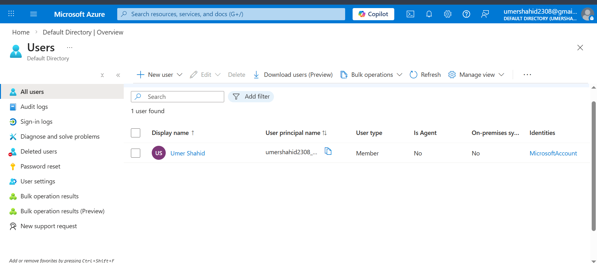
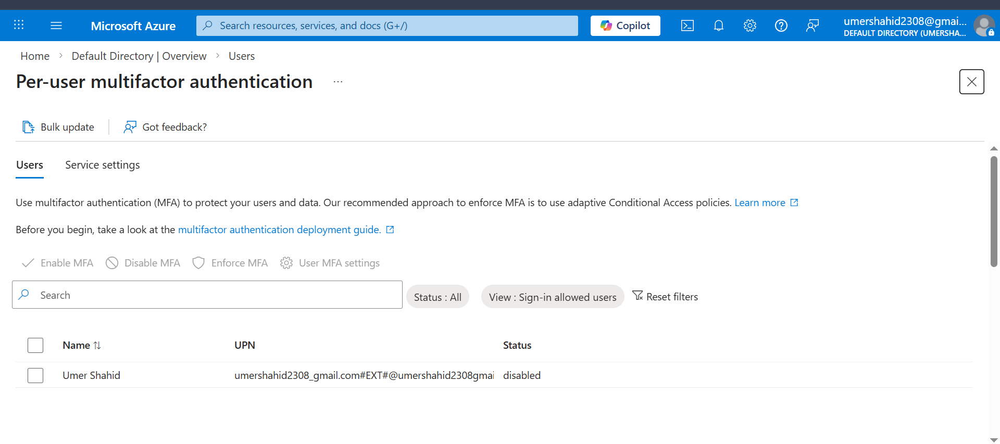
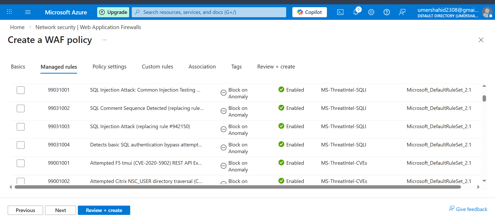
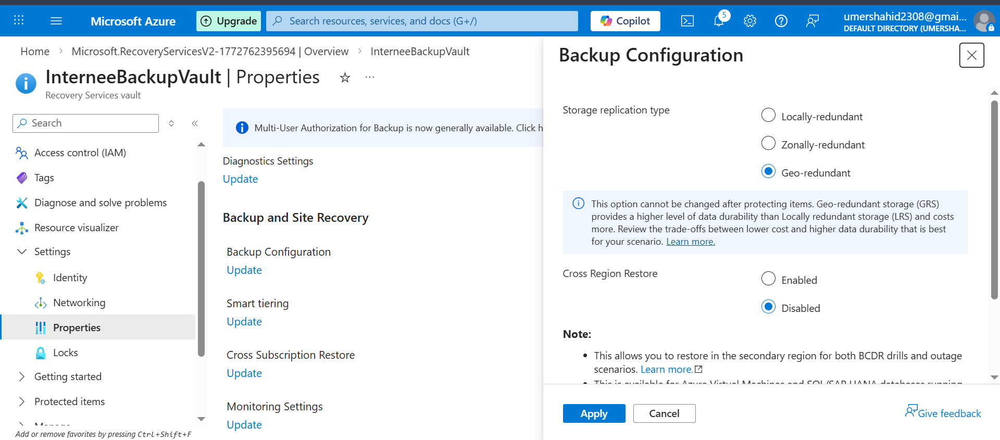

# 🛡️ Secure Cloud Infrastructure: Azure Security Hardening
🛡️ Assignment 2: Hardening Cloud Infrastructure
Organization: Internee.pk

Platform: Microsoft Azure

Security Analyst: Umer Shahid

📖 Project Overview
The goal of this project was to address critical security vulnerabilities within a cloud-based infrastructure. I performed an end-to-end security implementation following the CIS Microsoft Azure Foundations Benchmark. This documentation covers the audit, identity hardening, business continuity setup, and perimeter defense strategies applied to the environment.

🔍 Phase 1: Security Audit & Compliance Baseline
Before making any changes, it was vital to understand the current security posture. I used a data-driven approach to identify gaps in identity management and overall compliance.

1.1 User Inventory Audit
I conducted a thorough audit of Microsoft Entra ID (Azure AD) to verify all active administrative and guest accounts. This ensures we have a clean baseline of "Who" has access.

1.2 Multi-Factor Authentication (MFA) Audit
Identity is the new perimeter. I analyzed the MFA status of every user. Identifying accounts without MFA is the first step in preventing credential-based attacks.

1.3 Microsoft Defender for Cloud Secure Score
I established a baseline using Microsoft Defender for Cloud. An initial score of 0% was recorded, highlighting critical missing controls like MFA, resource governance, and logging.
_secure_score.png)

🛠️ Phase 2: Identity Hardening & Access Control
Using the results from the audit, I moved to active enforcement using Azure's native security features.

2.1 Enforcing Security Defaults
To immediately lower the risk of unauthorized access, I enabled Azure Security Defaults, which mandates MFA for all users and administrative roles.
_security_defaults_enabled.png)

2.2 Role-Based Access Control (RBAC) Implementation
Following the Principle of Least Privilege (PoLP), I moved away from "Global Admin" usage. I created a dedicated 'Security Auditor' role with restricted Reader permissions to ensure users only have the access they need for their specific jobs.
_RBAC.png)
_IAM_policy.png)

🌐 Phase 3: Perimeter Defense & Disaster Recovery
A secure cloud must be both resistant to attacks and resilient against regional failures.

3.1 Web Application Firewall (WAF) Deployment
To protect our web-facing assets from the OWASP Top 10 threats, I deployed an Azure WAF. I implemented Managed Rule Sets specifically designed to block SQL Injection (SQLi) and Cross-Site Scripting (XSS).

3.2 Geo-Redundant Storage (GRS) for Business Continuity
Data loss is a massive security risk. I configured a Recovery Services Vault with Geo-Redundant Storage (GRS). This replicates our data to a secondary geographic region, ensuring we can recover even if a whole Azure region goes offline.

📊 Phase 4: Continuous Monitoring & Governance
Security is not a one-time event; it is a continuous process.

4.1 Azure Activity Logs & Audit Trails
I finalized the implementation by reviewing the Azure Activity Logs. This provides a transparent audit trail of every configuration change made during the project, ensuring full accountability for administrative actions.
_activity_log.png)
_activity_log.png)

🏁 Final Conclusion
By implementing these four pillars—Audit, Identity, Resiliency, and Monitoring—I have successfully hardened the Internee.pk cloud tenant against modern cyber threats. The environment is now compliant with basic industry security standards and ready for production-level traffic.
